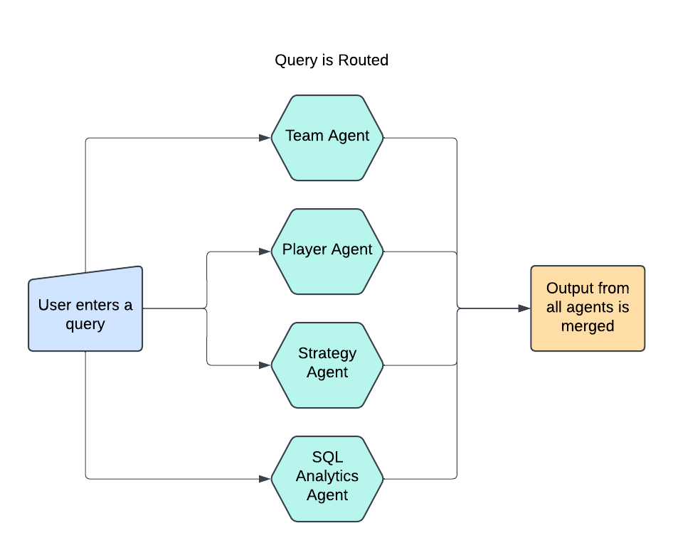

# SoccerAssistant

## Introduction

SoccerAssistant is a two-system chatbot we created for the Northwestern men's soccer team. It is designed to enhance performance both on and off the field. The first system focuses on **competitive strategy**, helping coaches and analysts review opponent tactics, assess strengths and weaknesses, and recommend strategies for upcoming matches. The second system is dedicated to **analytics**, providing detailed insights into player and team performance, aiding in **player evaluation** by tracking key metrics, and helping with **team evaluation** to identify areas for improvement. Together, these systems support the team’s decision-making process, helping the coaching staff make data-driven adjustments to improve both individual and team performance.

## Table of Contents
1. [Introduction](#introduction)
2. [Key Features](#key-features)
3. [Setup Instructions](#setup-instructions)
   - [Clone the Repository](#1-clone-the-repository)
   - [Set Up Virtual Environment](#2-set-up-a-virtual-environment)
   - [Set Up Environment Variables](#3-set-up-environment-variables)
   - [Run the Application](#4-run-the-application)
4. [Agentic Workflow](#agentic-workflow)
5. [Contributing](#contributing)

## Key Features

- **AI-Powered Chatbot Interface** seamlessly integrates with a dynamic 4-agent backend for real-time data processing.  
- **Instant Summary Analytics** to generate actionable insights, player comparisons, and interactive visualizations.  
- **Opponent Scouting Intelligence** leverages predictive analytics to identify weaknesses in opposing teams for strategic game planning.  
- **Advanced Player Performance Tracking**, including metrics like goals, assists, passing accuracy, and heatmaps for in-depth analysis.  
- **Comprehensive Team Analytics**, offering insights into possession rates, attacking efficiency, shots on target, and defensive resilience.  
- **Data-Driven Performance Optimization** through pinpointed areas of improvement using AI-aggregated team statistics.   

## Setup Instructions

Follow these steps to set up and run the SoccerAssistant project:

### 1. Clone the Repository
```bash
git clone https://github.com/ayush9818/SoccerAssistant.git
cd SoccerAssistant
```

### 2. Set Up a Virtual Environment
**For Linux/Mac:**
```bash
python3 -m venv .venv
source .venv/bin/activate
```

Install the required dependencies:
```bash
pip install -r requirements.txt
```

### 3. Set Up Environment Variables
Create a `.env` file in the project root directory and add the following variables:

```bash
cp env_template .env
```

- OPENAI_API_KEY : Replace it with appropriate API Key

### 4. Run the Application

1. Running the ChatAgent
   ```bash
   export PYTHONPATH=$(pwd):PYTHONPATH
   python chat_agent/app.py
   ```

The app will be running on http://127.0.0.1:7860

2. Running the SoccerStrat ChatAgent
   ```bash
   cd strategy_agent/SoccerStrat
   streamlit run soccer_app.py
   ```

The app will be running on http://localhost:8501

## Agentic Workflow 



### **Agentic Workflow Overview**

1. **Soccer Assistant Bot**:
   - The system represents a multi-agent architecture designed to process user queries in the context of soccer-related data.
   - It consists of multiple specialized agents, each focused on a specific type of information: 
     - **Team Agent**: Handles team-related information and statistics.
     - **Player Agent**: Focuses on player-specific statistics and performance.
     - **Strategy Agent**: Analyzes game strategies and tactics.
     - **SQL Analytics Agent**: Processes structured data queries using a Text-to-SQL capability.

2. **Query Handling**:
   - The user inputs a query into the system.
   - A central **LLM-based Selector** automatically determines which agents are relevant for the query. It intelligently re-routes the query to one or more agents.

3. **Agent Processing**:
   - Each agent processes the query independently based on its domain of expertise.
   - For example:
     - The Player Agent might fetch player statistics.
     - The SQL Analytics Agent might retrieve structured data from a database.
     - The Strategy Agent could analyze tactics or provide insights into game plans.

4. **Response Summarization**:
   - The outputs from all the agents are merged and summarized into a single cohesive response.
   - This ensures that the user receives a comprehensive answer to their query, drawing from all relevant domains.

This workflow ensures efficient and accurate handling of diverse soccer-related queries by leveraging the specialized capabilities of each agent. It uses LLM-driven intelligence for routing and summarization, creating an intelligent, user-friendly system.

## Contributing
- Ayush Agarwal
- Kevin Li
- Jason Huang
- Omar Shatrat

